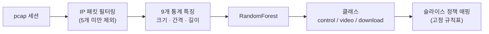

# Encrypted Traffic Classification

TLS 1.3으로 암호화된 트래픽을 복호화 없이, 패킷 크기와 도착 간격, 세션 길이 통계만으로 분류하는 실험입니다.
분류 결과를 네트워크 슬라이스 정책에 대응시키는 시연 대시보드를 함께 담았습니다.

> [!NOTE]
> 이 저장소는 상용 O-RAN이나 E2 인터페이스 구현이 아닙니다.
> 제어 행위를 단순 모사한 개인 테스트베드 수준의 학부 연구 결과물이며,
> 슬라이스 할당은 학습된 판단이 아니라 분류 결과를 고정 규칙표에 대응시킨 것입니다.

연구는 두 갈래로 진행했고, 이 저장소에 올린 결과는 그중 두 번째입니다.

| 단계 | 내용 |
|---|---|
| 테스트베드 구축 | VMware에 Ubuntu 22.04 서버·클라이언트 VM을 올리고, stunnel로 TLS 1.3 구간을 만든 뒤 Python으로 트래픽을 생성해 tcpdump로 수집하고 Wireshark/tshark로 TCP stream을 분리했습니다. 환경 구성과 수집 절차를 익힌 단계입니다. |
| 분류 실험 | 사이트별로 라벨링된 공개 TLS 1.3 데이터셋으로 표본 수를 확보하고 분류 성능을 측정했습니다. 아래 정확도와 `data/`의 CSV는 모두 이쪽에서 나온 것이며, 자체 수집 트래픽으로 낸 수치가 아닙니다. |

---

## 결과

| 실험 | 클래스 | 표본 수 | 행 단위 hold-out 정확도 |
|---|---|---:|---:|
| 2분류 (기본) | bulk / control | 1,200 | 97.08% |
| 3분류 (확장) | control / video / download | 2,400 | 95.21% |
| 3분류 (크기 필터 적용) | control / video / download | 992 | 93.97% |

모두 동일한 4개 사이트에서 파생된 표본 행을 8:2로 무작위 층화 분할하고,
`RandomForestClassifier(n_estimators=100, random_state=42)`로 측정한 초기 실험 결과입니다.
사이트·수집 환경을 분리한 외부 검증 결과가 아니므로 새로운 환경에 대한 일반화 성능으로 해석할 수 없습니다.
2분류 결과는 [`notebooks/01_traffic_classification.ipynb`](notebooks/01_traffic_classification.ipynb)에 셀 출력으로 남아 있습니다.

bulk를 video와 download로 나누면 정확도가 약 2%p 떨어집니다.
두 트래픽 모두 대역폭을 크게 쓰는 전송 패턴이라 통계적으로 겹치는 구간이 있고,
오차 행렬에서도 이 둘 사이의 혼동이 대부분을 차지합니다.

분류에 가장 크게 기여한 특징은 평균 패킷 크기와 패킷 크기 표준편차였습니다.
페이로드를 보지 못하더라도 큰 패킷이 꾸준히 흐르는지, 작은 패킷이 띄엄띄엄 오가는지만으로
두 유형이 갈린다는 의미입니다.

---

## 방법



**특징 9개** — `avg/std/max/min_pkt_size`, `avg/std/max_delta_time`, `duration`, `total_packets`

**라벨링** — 사이트 단위로 그룹을 정의했습니다.
세션 하나하나에 사람이 라벨을 붙인 것이 아니라, 어느 사이트로 간 트래픽인지에 따라 그룹을 부여한 방식입니다.

| 사이트 | 2분류 | 3분류 |
|---|---|---|
| steamstatic.com | bulk | download |
| wistia.com | bulk | video |
| google.com | control | control |
| twitter.com | control | control |

---

## 구성

```text
├── notebooks/
│   └── 01_traffic_classification.ipynb   2분류 실험 전체 (97.08% 결과 포함)
├── src/
│   └── feature_extraction.py             pcap → 특징 CSV 변환 CLI
├── apps/
│   ├── dashboard.py                      분류 성능 + 슬라이스 매핑 대시보드
│   └── tracker_demo.py                   발표용 세션 로그 재생 화면
└── data/
    ├── validation_data.csv               3분류 992건 (크기 필터 적용)
    └── validation_data_nofilter.csv      3분류 2,400건
```

---

## 실행

```bash
pip install -r requirements.txt
streamlit run apps/dashboard.py
```

다른 데이터로 보려면 `ORAN_DATA` 환경변수로 CSV 경로를 지정합니다.

```bash
ORAN_DATA=data/validation_data_nofilter.csv streamlit run apps/dashboard.py
```

pcap 원본에서 특징을 다시 뽑으려면 다음과 같이 실행합니다 (3분류 2,400건 = 폴더당 600개).

```bash
python src/feature_extraction.py --input data/raw/mix --labels steamstatic.com=download,wistia.com=video,google.com=control,twitter.com=control --samples-per-folder 600 --output data/validation_data_nofilter.csv
```

노트북의 2분류 1,200건은 같은 경로에
`--labels steamstatic.com=bulk,wistia.com=bulk,google.com=control,twitter.com=control --samples-per-folder 300`으로 만듭니다.

`validation_data.csv`는 여기에 `--min-file-size` 필터를 추가로 걸어 만든 것인데,
당시 사용한 임계값이 기록에 남아 있지 않아 정확히 같은 992건을 재현하는 명령은 제시하지 못합니다.

코드·CSV·노트북의 정적 검증과 3분류 결과 재현 테스트는 다음과 같이 실행합니다.

```bash
pip install -r requirements-dev.txt
pytest -q
```

---

## 데이터

pcap 원본(약 2.5GB, 19,000여 개)은 저장소에 포함하지 않았습니다.
용량 문제도 있지만, 파일명에 캡처 환경의 IP 주소와 접속 도메인이 그대로 들어 있기 때문입니다.
저장소에는 특징 추출이 끝난 CSV만 두었습니다.

프로젝트 기록상 이 pcap은 [CipherSpectrum: TLS 1.3 Encrypted Network Traffic Dataset](https://cgi.cse.unsw.edu.au/~cspectrum/)에서 가져온 것이고,
자체 테스트베드에서 캡처한 트래픽이 아닙니다. 원본은 이 저장소에서 재배포하지 않습니다.

CipherSpectrum은 **CC BY-NC 4.0**으로 제공됩니다. `data/`의 CSV는 원본 pcap에서 9개 통계 특징을 추출하고
사이트를 실험용 트래픽 그룹으로 매핑한 파생 데이터이며, 데이터 파일에는 같은 비상업 조건과 출처 표시가 적용됩니다.
상업적 이용에는 원 저자의 사전 허가가 필요합니다. 자세한 출처·변환 내용·인용은
[`data/README.md`](data/README.md)를 확인하세요.

**테스트베드 구축 단계에서 사용한 도구**
VMware · Ubuntu 22.04 · stunnel(TLS 1.3) · tcpdump · Wireshark/tshark · Scapy · pandas · scikit-learn · Streamlit

---

## 한계

이 결과를 그대로 상용 환경에 적용할 수 없는 이유를 적어둡니다.

- **라벨이 사이트 단위입니다.** 모델이 배운 것이 트래픽 유형인지 그 사이트 서버의 응답 패턴인지
  이 실험만으로는 분리되지 않습니다. 사이트 4개로 학습했으므로 다른 사이트에 대한 일반화는 검증되지 않았습니다.
- **한 캡처 환경에서 나온 데이터입니다.** 회선 상태, 브라우저, 암호 스위트가 고정된 조건이라
  네트워크 조건이 달라지면 성능이 유지된다는 근거가 없습니다.
- **세션이 끝난 뒤 계산하는 특징입니다.** `duration`과 전체 패킷 수를 쓰기 때문에
  세션 진행 중 실시간 판정에는 그대로 쓸 수 없습니다. 앞부분 N개 패킷만으로 판정하는 방식은 따로 검증해야 합니다.
- **슬라이스 할당은 규칙표입니다.** `apps/dashboard.py`의 `SLICE_POLICY` 딕셔너리가 전부이며,
  실제 RIC 연동이나 자원 제어는 없습니다.
- **`apps/tracker_demo.py`의 Est. App과 Source IP 열은 발표 화면을 채우기 위한 예시값입니다.**
  모델이 낸 값은 트래픽 유형과 확신도뿐이며, 이 프로젝트는 세션의 출처나 접속 서비스를 식별하지 않습니다.
  화면 상단에도 같은 내용을 배너로 표시합니다.

---

## 라이선스

이 저장소에서 직접 작성한 코드는 [MIT License](LICENSE)로 제공합니다.
`data/`의 파생 CSV에는 원 데이터의 [CC BY-NC 4.0](data/README.md) 조건이 적용됩니다.
